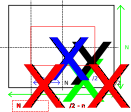

# Explaining the Auto centered co-ordinate computation

You have a Numerical size of a grid `Nx` and `Ny`. That gives you how many cells exists in the physical space.

The mid point of each axis is just: `Nx/2` and `Ny/2`.

And you have the physical size of rectangle: `wx` and `wy`.

So, **the starting co-ordinate for a rectangle of size `wx` and `wy` is to move half a length before the mid point of axis `Nx/2` and `Ny/2`.** That is,

```
Starting Co-ordinate of rectangle - x axis: (Nx/2 - nx/2)
Starting Co-ordinate of rectangle - y axis: (Ny/2 - ny/2)
```

See `Fig_01` to understand it better:


<figcaption><b>Figure 01:</b> How to compute starting co-ordinate for placing the rectangle in the centre - X coordinate computation</figcaption>

<br>

From `Fig_01`, we can see that in order to align the centre of a rectangle to the centre of physical space, we need to compute the starting co-ordinate of such a rectangle just half it's length/width before the actual mid-point of physical space.

## Why Add 1 to the starting co-ordinate?

Sometimes the computation may give a 0 (zero). But MATLAB handles positions in a matrix **by starting the indices from 1 and not 0 (zero).**

So, the final computation is:

```
Starting Co-ordinate of rectangle - x axis: 1 + (Nx/2 - nx/2)
Starting Co-ordinate of rectangle - y axis: 1 + (Ny/2 - ny/2)
```

## What about the ending co-ordinate

Simple. You know that the rectangle is `wx` and `wy` dimensions. If the starting co-ordinates are `1 + (Nx/2 - nx/2)` and `1 + (Ny/2 - ny/2)` then the ending co-ordinates are just `wx` and `wy` distance away from starting co-ordinates!

```
Ending Co-ordinate of rectangle - x axis: 1 + (Nx/2 - nx/2) + wx
Ending Co-ordinate of rectangle - y axis: 1 + (Ny/2 - ny/2) + wy
```

## Why round the results?

Well, in our mesh grid, we can't fill 10.1 cells that is 10 cells and 1/10th of a cell. You can only fill cells in integer amounts.

Therefore, the final **implementation** equations are:

```
1 + round(Nx/2 - nx/2) + wx
1 + round(Ny/2 - ny/2) + wy
```