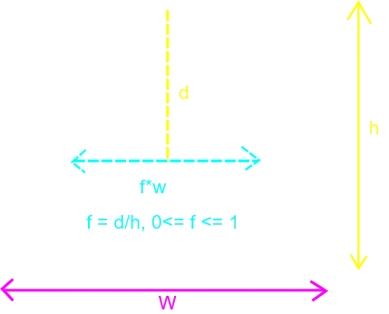

# Explaining how the triangle is formed

The trick in filling a triangle, is to move from top to bottom along height. We will use just the **simple equilateral triangle**.

See Figure 01:


<figcaption><b>Figure 01:</b> Computing the width of triangle as we move along the height</figcaption>

<br>

At the top, we have no width. And the bottom (or at full depth of h from top) we have full width, W. In between we have a **proportional width which depends on how far we have traversed with respect to the total height, h.**

```
When d = 0,         f = 0   => No width
When d = h,         f = 1   => Full width
When d in between,  f = d/h => Width = f * w
```

Repeat till you traverse the full height.