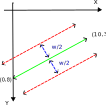

# How the line fill is achieved

First off, we find the distance function D. Which I have no idea how or why it works.

>📝 **NOTE:** Asked about the lecture notes on comments of the [lecture video](https://www.youtube.com/watch?v=IHsuR5S_mj4) on 19/06/26 (00:46 AM). Let's hope he answers.

And then the trick is to simply fill all positions that are at a distance `w/2` from the central line.


<figcaption><b>Figure 01:</b> Filling a line of width, w, centered around central line</figcaption>

<br>

This is easily accomplished by simply doing a boolean comparison of all cells which are at a distance, `w/2` from the central line:

```
LFILL = abs(D) < w/2;
```